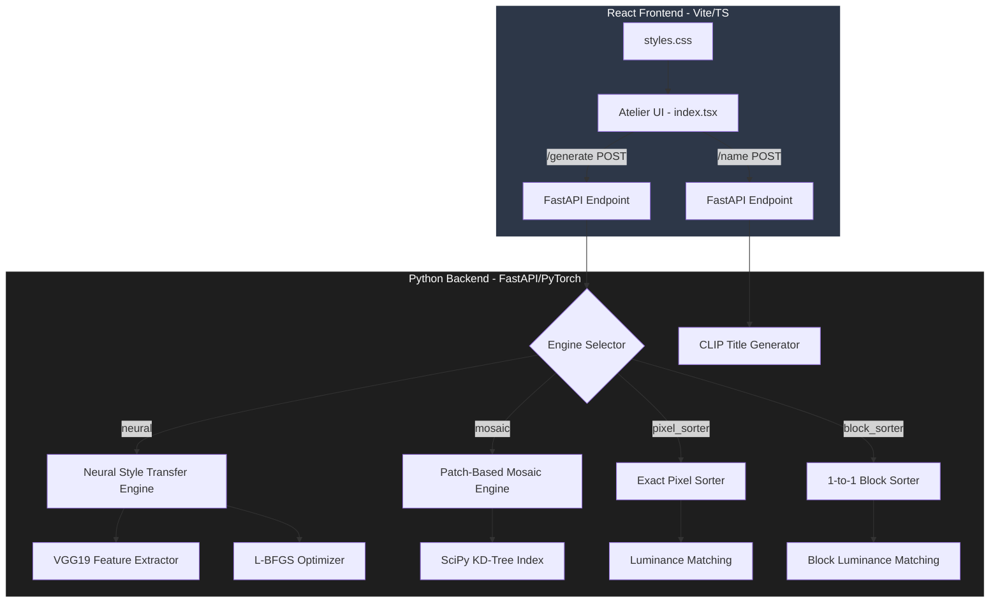

   
    
    
    
    
    
   

  <h1>🎨 Neural Mosaic Reconstruction (The Atelier)</h1>
  
  

    An AI-powered computational art engine that reconstructs a subject portrait using the visual language, color distribution, or geometric fragments of a style reference image. 
  

  

    <a href="#overview">Overview</a> •
    <a href="#how-it-works">How It Works</a> •
    <a href="#architecture">Architecture</a> •
    <a href="#core-engines">Core Engines</a> •
    <a href="#tech-stack">Tech Stack</a>
  

---

## 🌟 Overview

Standard image editing and filter tools apply simple pixel overlays or color transformations without a mathematical understanding of facial structure or artistic composition. Traditional Neural Style Transfer (NST) can generate beautiful images, but it is extremely computationally intensive and prone to messy artifacts. 

**The Atelier** bridges deep feature representation and computational geometry. It offers four distinct mathematical and neural reconstruction engines that balance artistic fidelity, structural preservation, and raw generation speed, allowing you to recreate any portrait in the exact style and medium of another image.

---

## ⚙️ How It Works

The Atelier operates through a streamlined Client-Server pipeline, executing advanced visual algorithms on demand:

1. **Upload & Analyze:** You upload a target Subject image and a Style Reference image.
2. **Zero-Shot Naming:** The backend immediately runs both images through a lazy-loaded **OpenAI CLIP (Vision-Language) Model**. It classifies the subject and the stylistic "world," automatically generating a poetic title for the artwork (e.g., *"Study of [Subject] in the Manner of [World]"*).
3. **Engine Selection:** You choose one of four distinct reconstruction engines (Neural, Mosaic, Pixel Sorter, or Block Sorter).
4. **Mathematical Reconstruction:** The backend extracts deep convolutional features (VGG19) or geometric patches, optimizing the image matrix to combine the subject's structure with the reference's texture/colors.
5. **Real-Time Rendering:** The React UI displays the generated artwork alongside its AI-generated title in a premium museum gallery dashboard.

---

## 🏗️ Architecture

The project is structured as a full-stack application, cleanly separating the React exhibition interface from the intensive PyTorch computational backend.

---

## 🧠 Core Reconstruction Engines

The system features four distinct algorithms for image synthesis:

### 1. Neural Style Transfer (NST)
Uses a pretrained **VGG19** network to separate content and style. It optimizes the pixel intensities of a canvas using an **L-BFGS optimizer** to minimize Content Loss (at layer `conv4_2`) and Style Loss (average MSE of Gram Matrices across 5 layers).

### 2. Patch-Based Mosaic Engine
A non-neural, math-driven engine. It extracts thousands of overlapping square patches (e.g., 20x20) from the style image, converting them to grayscale signatures. It indexes them using a spatial **SciPy KD-Tree**, and swaps target image blocks with their nearest style neighbor based on grayscale structure.

### 3. Exact Pixel Sorter 
Rearranges 100% of the individual pixels of the style image to match the structure of the target image. It maps style pixels sorted by brightness 1-to-1 onto the target's luminance coordinates, guaranteeing an identical color histogram to the style reference.

### 4. 1-to-1 Block Sorter
Solves the "pixelated" limitation of pixel sorting. It chops both source and target images into non-overlapping blocks, calculating average luminance. It maps the blocks 1-to-1, perfectly preserving local color clusters and textures.

---

## 🛠️ Technology Stack

### Backend (Deep Learning & APIs)
- **Languages:** Python 3.x
- **Deep Learning:** PyTorch, TorchVision (VGG19)
- **Vision-Language (NLP):** Hugging Face Transformers (`openai/clip-vit-base-patch32`)
- **Scientific Computing:** NumPy, SciPy (`scipy.spatial.KDTree`)
- **Web Framework:** FastAPI, Uvicorn

### Frontend (UI & Exhibition)
- **Framework:** React 19, TypeScript, Vite
- **Routing:** TanStack Router
- **Styling:** TailwindCSS v4, Custom CSS (OKLAB color-mix, canvas noise shaders)
- **Components:** Radix UI Primitives, Lucide React Icons

---

  
Where Computational Geometry meets Artistic Expression.

